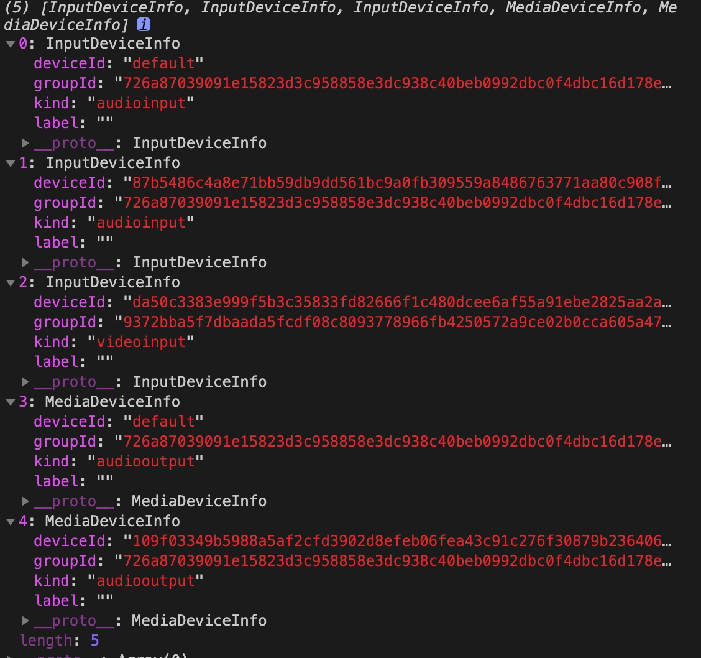
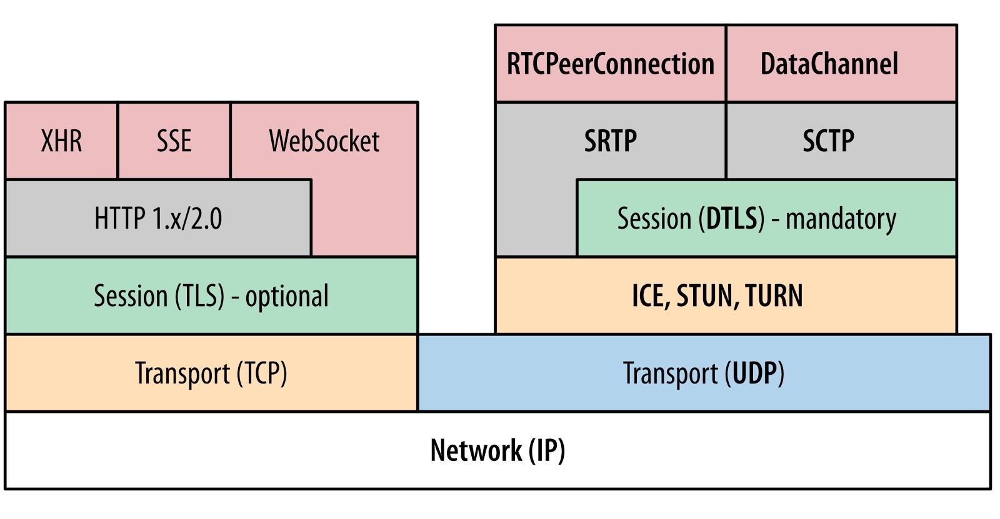
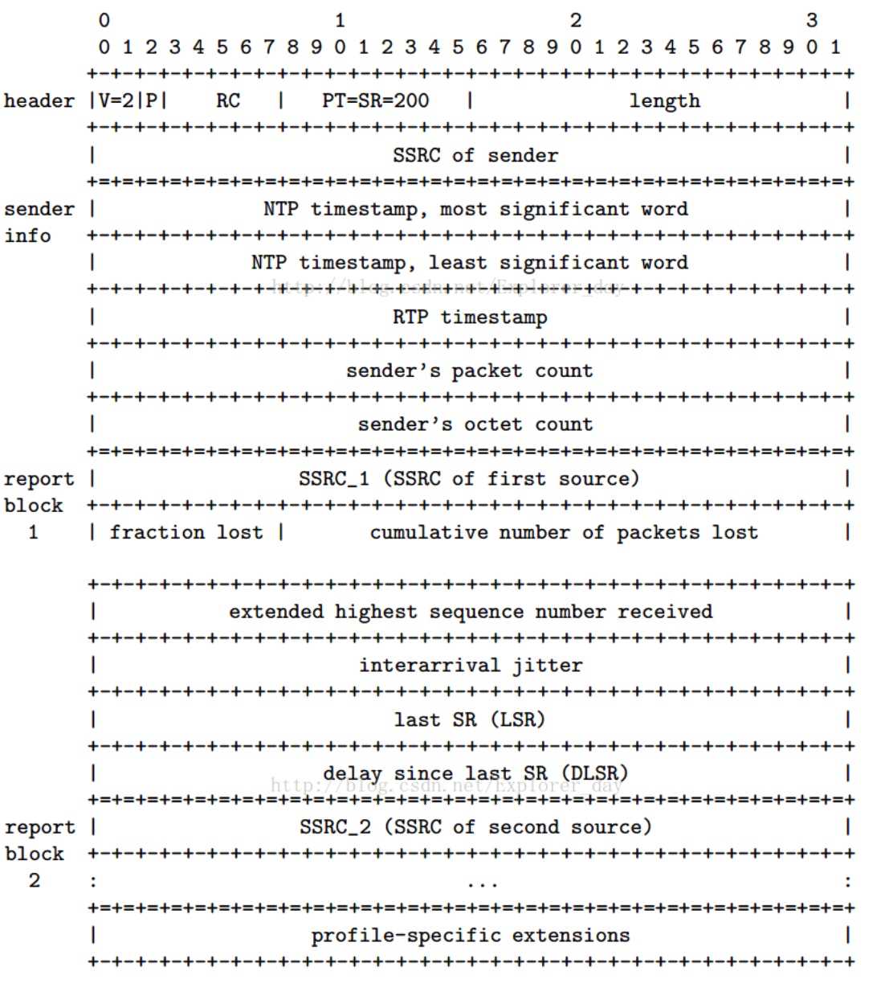

# 一、WebRTC基础介绍
## 什么是webRTC
WebRTC 全称是（Web browsers with Real-Time Communications (RTC)
大概2011年，谷歌收购了 GIPS，它是一个为 RTC 开发出许多组件的公司，例如编解码和回声消除技术。Google 开源了 GIPS 开发的技术，并希望将其打造为行业标准。
> 在QQ2004版后，通话质量大有改善，就是采用了GIPS的技术。并第一次表明版权：本软件中使用的GIPS语音引擎和相关商标为Global IP Sound AB公司版权所有~~~~

收购花了一大笔钱，谷歌说开源就开源，确实不得不佩服，但显然对于Googl来说，打造音视频的开源生态有着更大的价值。“浏览器 + WebRTC”就是 Google 给出的一个答案。而它的终极目标就是在浏览器之间实现音视频通信。

发展至今日，WebRTC在浏览器的支持性已经大大增强。
**WebRTC是一个免费、开放的项目。使web浏览器通过简单的JavaScript api接口实现实时通信功能。**

## WebRTC应用场景

1. 在线教育
2. 多人音视频实时通话
3. 网络直播

## WebRTC原理与架构


**Web API层**：面向开发者提供[标准API](http://w3c.github.io/webrtc-pc/)（javascirpt），前端应用通过这一层接入使用WebRTC能力。

**C++ API层**：面向浏览器开发者，使浏览器制造商能够轻松地实现Web API方案。

**音频引擎（VoiceEngine）**：音频引擎是一系列音频多媒体处理的框架，包括从视频采集卡到网络传输端等整个解决方案。
1. iSAC/iLBC/Opus等编解码。
2. NetEQ语音信号处理。
3. 回声消除和降噪。

**视频引擎（VideoEngine）**： 是一系列视频处理的整体框架，从摄像头采集视频、视频信息网络传输到视频显示整个完整过程的解决方案。
1. VP8编解码。
2. jitter buffer：动态抖动缓冲。
3. Image enhancements：图像增益。

**传输（Transport)**：传输 / 会话层，会话协商 + NAT穿透组件。
1. RTP 实时协议。
2. P2P传输 STUN+TRUN+ICE实现的网络穿越。

**硬件模块**：音视频的硬件捕获以及NetWork IO相关。

## WebRTC重要的类及概念
### Network Stream API - MediaStream（媒体流）/MediaStreamTrack（媒体轨）
这个类并不完全属于WebRTC的范畴，但是在本地媒体流获取，及远端流传到vedio标签播放都与WebRTC相关。
MS 由两部分构成： MediaStreamTrack 和 MediaStream。

* MediaStreamTrack 是媒体轨，代表一种单类型数据流，可以是音频轨或者视频轨。

* MediaStream 是一个完整的音视频流。它可以包含 >=0 个 MediaStreamTrack。它主要的作用就是确保几个媒体轨道是同步播放。


### RTCPeerConnection

WebRTC使用RTCPeerConnection，用于实现peer跟peer之间RTC连接，继而**无需服务器**就能传输音视频数据流的连接通道。（直播的实际生产中还是需要服务器）。


这么说过于抽象，为了帮助理解，可以用一个**不太恰当**但有助于理解的比喻：`RTCPeerConnection`就是一个**高级且功能强大**的用于**传输音视频数据**而建立类似Websocket链接通道，只不过它不仅可以client to server还可以

之所以说是高级且强大，是因为它作为WebRTC web层核心API，让你无须关注数据传输延迟抖动、音视频编解码，音画同步等问题。直接使用PeerConnection 就能自动用上这些浏览器提供的底层封装好的能力。

### Peer-to-peer Data API

RTCDataChannel可以建立浏览器之间的点对点通讯。常用的通讯方式有websocket, ajax和等方式。websocket虽然是双向通讯，但是无论是websocket还是ajax都是客户端和服务器之间的通讯，你必须配置服务器才可以进行通讯。

而由于RTCDATAChannel借助RTCPeerConnection无需经过服务器，就可以提供点对点之间的通讯，无需/(避免)服务器了这个中间件。


# 二、浏览器的音视频采集及设备管理
## 音视频采集基本概念

在讲浏览器提供的用JS 采集音视频API之前，需要先了解音视频采集的基本概念。

* **摄像头**：用于捕捉（采集）图像和视频。

* **帧率**：Frame rate 摄像头一秒钟采集图像的次数称为帧率。帧率越高，视频越流畅，但每秒传输率也越大，宽带占用就越高。而在显示器上，同样的概念称之为刷新率，就越高越好。

* **分辨率**：分辨率是用于度量视频图像内数据量多少的一个参数，通常表示成ppi。一般有1080P、720P、320P 等。宽高比一般为4:3或16:9。和帧率相同，分辨率越高越清晰，但在直播中占用的宽带越多。因此分辨率应该根据网络情况进行动态调整。

* **麦克风**: 用于采集音频数据。
* **采样率**：指录音设备在一秒钟内对声音信号的采样次数，采样率越高还原声音越真实。8,000 Hz 是 电话通话所用采样率, 对于人的说话已经足够。

* **轨（Track）**: WebRTC 中的“轨”借鉴了多媒体的概念。“轨”在多媒体中表达的就是每条轨数据都是独立的，分为音频轨、视频轨。

* **流（Stream）**: 可以理解为容器。在 WebRTC 中，“流”可以分为媒体流（MediaStream）和数据流（DataStream）。

## 音视频设备与采集

### getUserMedia
getUserMedia 方法在浏览器中访问音视频设备非常简单。

```javascript
var promise = navigator.mediaDevices.getUserMedia(constraints);
```

结果会通过**Promise**返回stream，用URL.createObjectURL/srcObject转换后，设置为Video或Audio元素的src属性来进行播放。

失败时promise catchError 可能的异常有：

1. AbortError：硬件问题
2. NotFoundError：找不到满足请求参数的媒体类型。
3. NotReadableError：操作系统上某个硬件、浏览器或者网页层面发生的错误导致设备无法被访问。
4. TypeError：类型错误，constraints对象未设置空，或者都被设置为false。
5. OverConstrainedError：指定的要求无法被设备满足。
6. SecurityError：安全错误，需要用户浏览器设置中开启。
7. NotAllowedError：用户拒绝了当前的浏览器实例的访问请求；或者用户拒绝了当前会话的访问；或者用户在全局范围内拒绝了所有媒体访问请求。


### MediaStreamConstraints 参数

媒体约束-MediaStreamConstraints，可以在 getusermedia时指定 MediaStream 中要包含哪些类型的媒体轨，并且设置一些限制。

1. 可以指定采集音频还是视频，或是同时对两者进行采集。
```javascript
const mediaStreamContrains = { 
    video: true, 
    audio: true
};
```

2. 也可以进一步对媒体做限制。
```javascript
const mediaStreamContrains = { 
    video: { 
        frameRate: {
            min: 20
        }, 
        width: {
            min: 640, 
            ideal: 1280
        },
        height: {
            min: 360, 
            ideal: 720
        }, 
        aspectRatio: 16/9 
    },
    audio: { 
        echoCancellation: true, 
        noiseSuppression: true, 
        autoGainControl: true 
    }
};
```

### 使用采集到的音视频媒体流
通过getUserMedia采集到的媒体流,可以再本地直接播放使用。
```html
<video autoplay playsinline></video>
```

```javascript
const mediaStreamContrains ={ 
    video: true 
};
const localVideo = document.querySelector('video');

function gotLocalMediaStream(mediaStream) {
  localVideo.srcObject = mediaStream;
}

function handleLocalMediaStreamError(error) {
  console.log('navigator.getUserMedia失败: ', error);
}
navigator.mediaDevices.getUserMedia(mediaStreamContrains).then(gotLocalMediaStream).catch(handleLocalMediaStreamError);

```

## 音视频设备管理

MediaDevices接口提供了访问（连接到计算机上的）媒体设备（如摄像头、麦克风）以及屏幕分享的方法。

我们可以通过它，获取可用的音视频设备列表。

MediaDeviceInfo，它表示的是每个输入 / 输出设备的信息:

* deviceID： 设备的唯一标识
* label： 设备名称
* kind：设备种类：可用于识别出是音频设备还是视频设备，是输入设备还是输出设备。

需要注意的是，出于安全原因，**除非用户已被授予访问媒体设备的权限（要想授予权限需要使用 HTTPS 请求），否则 label 字段始终为空。** 另外，label 可以用作指纹识别机制的一部分，以识别是否是合法用户。

### 获取音视频设备列表

```javascript
MediaDevices.enumerateDevices().then((deviceList)=>{console.log(deviceList)})
```
 
 

通过调用`navigator.MediaDevices.enumerateDevices() `返回每一个 MediaDeviceInfo，并将每个 MediaDeviceInfo 中的基本信息打印出来，也就是我们想要的每个音视频设备的基本信息。

可以通过 kind 字段再将设备区分为：音频/视频设备，输入/输出设备。
根据deviceid，能知道该设备是否为**默认设备**。

> 这个音频设备为例，将耳机插入电脑后，耳机就变成了音频的默认设备；将耳机拔出后，默认设备又切换成了系统的音频设备。


### 浏览器端的音视频录制


录制从端来说， 可以分为**服务端录制**和**客户端录制**。

* 服务端录制：无须心客户端因电脑问题造成录制失败（如磁盘空间不足、CPU 占用率过高等问题）；缺点是实现的复杂度很高。

* 客户端录制：优点是方便录制者（如老师）操控，所录制的视频清晰度高,实现相对简单。缺点是，录制时会开启的编码器，很耗CPU，且对内存和硬盘要求也高，一旦硬件占高负载会容易造成程序卡死。

#### JavaScript的二进制数据对象

在 JavaScript 中，有很多用于存储二进制数据的类型，这些类型包括：ArrayBuffer、ArrayBufferView 和 Blob。WebRTC 录制音视频流之后，最终是通过 Blob 对象将数据保存成多媒体文件的。

**ArrayBuffer**
ArrayBuffer 对象表示通用的、固定长度的二进制数据缓冲区。因此，你可以直接使用它存储图片、视频等内容。

```javascript

let buffer = new ArrayBuffer(16); // 创建一个长度为 16 的 buffer
let view = new Uint32Array(buffer);

```

```javascript
let buffer = new Uint8Array([255, 255, 255, 255]).buffer;
let dataView = new DataView(buffer);
```
一开始生成的 buffer 是不能被直接访问的。只有将 buffer 做为参数生成一个具体的类型的新对象时（如 Uint32Array 或 DataView），这个新生成的对象才能被访问。


 **ArrayBufferView**

ArrayBufferView 并不是一个具体的类型，而是代表不同类型的 Array 的描述。这些类型包括：Int8Array、Uint8Array、DataView 等。也就是说 Int8Array、Uint8Array 等才是 JavaScript 在内存中真正可以分配的对象。


**Blob**
Blob（Binary Large Object）是 JavaScript 的大型二进制对象类型，WebRTC 最终就是使用它将录制好的音视频流保存成多媒体文件的。而它的底层是由上面所讲的 ArrayBuffer 对象的封装类实现的，即 Int8Array、Uint8Array 等类型。

```javascript
var aBlob = new Blob( array, options );
```


#### 浏览器录制方法

浏览器为我们提供了一个录制音视频的类，即 MediaRecorder。

```javascript
var mediaRecorder = new MediaRecorder(stream[,options]);
```
参数解释：
* stream: 通过 getUserMedia 获取的本地视频流或通过 RTCPeerConnection 获取的远程视频流。
* options:可选项，指定视频格式、编解码器、码率等相关信息，如 mimeType: 'video/webm;codecs=vp8'。

**录制流**
```javascript

var buffer;

//当该函数被触发后，将数据压入到blob中
function handleDataAvailable(e){
        if(e && e.data && e.data.size > 0){
                buffer.push(e.data);
        }
}

function startRecord(){
        buffer = [];
        //设置录制下来的多媒体格式 
        var options = {
                mimeType: 'video/webm;codecs=vp8'
        }

        //判断浏览器是否支持录制
        if(!MediaRecorder.isTypeSupported(options.mimeType)){
                console.error(`${options.mimeType} is not supported!`);
                return;
        }

        try{
                //创建录制对象
                mediaRecorder = new MediaRecorder(window.stream, options);
        }catch(e){
                console.error('Failed to create MediaRecorder:', e);
                return;
        }

        //当有音视频数据来了之后触发该事件
        mediaRecorder.ondataavailable = handleDataAvailable;
        //开始录制
        mediaRecorder.start(10);
}

...
```

#### 播放录制文件
首先根据 buffer 生成 Blob 对象；然后，根据 Blob 对象生成 URL，并通过 video标签进行播放。

```html
<video id="playback"></video>
```
```javascript

 var blob = new Blob(buffer, {type: 'video/webm'});
 playback.src = window.URL.createObjectURL(blob);
 playback.srcObject = null;
 playback.controls = true;
 playback.play();
```

## 屏幕分享

桌面分享可以当做特殊音视频数据来看待，在实时音视频，尤其是在在线教育场景中，尤为常见。

对于屏幕分享者：每秒钟多次抓取的屏幕，每一屏数据取它们的差值，然后对差值进行压缩；如果差值超过一定程度，则单独对这一屏数据进行帧内压缩，该压缩方法，类似于视频编码中GOP的I帧。

对于远端观看/控制者：收到数据进行解压缩，还原成画面播放即可。另外如果有操控指令，需要实现对应的信令系统，并自行信令控制。

总结为以下流程：
抓屏、压缩编码、传输、解码、显示、控制。和音视频流程基本一致。

屏幕分享的协议有：
* RDP（Remote Desktop Protocal）：windows下的桌面共享协议。
* VNC（Virtual Network Console）：在不同的操作系统上共享远程桌面，像 TeamViewer、RealVNC 都是在使用这个协议。

### WebRTC的屏幕分享

由于webrtc不包含控制部分，因此它的处理过程只使用了视频方式，而不需要信令控制。因此它和 RDP/VNC还是存在差异。

1. 桌面数据的采集
在桌面数据采集上，和VNC一样是通过各平台提供的API实现的。
BitBlt、Hook、DirectX等。最新的 WebRTC 都是使用的这种方式GetWindowDC：可以通过它来抓取窗口。

1. 桌面数据的编码
WebRTC 对桌面的编码使用的是视频编码技术，即 H264/VP8 等（好处就是压缩率高）；但 RDP/VNC 则不一样，它们使用的是图像压缩技术。

1. 传输
webrtc有根据网络情况的调节能力，网络差时会进行丢数据保证实时性。

1. 解码渲染
解码同第二点，渲染一般会通过 OpenGL/D3D 等 GPU进行渲染。


通过 `getDisplayMedia` API 来采集桌面：

> 特别注意: 在桌面采集的参数里，不能对音频进行限制了。也就是说，不能在采集桌面同时采集音频。

```javascript

//get桌面数据流
function getDeskStream(stream){
    localStream = stream;
}

//采集桌面
function shareDesktop(){
        //只有在 PC 下才能抓取桌面
  if(utils.isPC){
                //开始捕获桌面数据
       navigator.mediaDevices.getDisplayMedia({video: true})
            .then(getDeskStream)
            .catch(handleError);
      return true;
  }          
  return false;     
}  
```
而展示和录制和音视频的展示和录制是实现方式基本相同。

以上就是浏览器端WebRTC通过设备采集音视频数据及其播放与录制的相关介绍。有了数据，接下来才可以使用WebRTC来实现实时音视频通讯。

# 三、信令通道服务
# 四、WebRTC数据传输协议-UDP/RTP/RTCP

## 音视频数据传输：UDP还是TCP？

我们都知道http协议，运行于TCP协议之上，是万维网的运转的基础。TCP作为传输层协议，使用三次握手协议建立连接（经典考题），以及一系列措施措施来确保传输的可靠性。那么WebRTC为什么选择UDP而不是TCP呢？

首先来看TCP和UDP的区别：

* TCP是面向连接的，UDP是无连接的。
* TCP提供可靠的创术，也就是说TCP连接传输的数据不会丢失，没有重复，并且按顺序到达，UDP提供不可靠传输。
* TCP是面向字节流的，实际上是TCP把数据看成一连串无结构的字节流；UDP是面向报文的。
* TCP提供拥塞控制和流量控制机制； UDP不提供拥塞控制和流量控制机制。

既然TCP有这么多优点特性，那么为什么在音视频传输中使用UDP呢？

由于UDP不属于连接型协议，因而具有资源消耗小，处理速度快的优点。

> 通常实时音频视频数据在传输的少量数据包丢失，对接收者影响并不大。而此时TCP的可靠性反而成了累赘，TCP协议的超时重传机制中RTT是以2的指数的增长，7次仍失败将会断开，理论计算会达到2分钟，在音视频延迟中相当差的效果。

**这种只管发不管收的特性，使得UDP在实时性和效率性都很高，在实时音视频传输中通常会选用UDP协议作为音视频传输协议**



WebRTC也是如此，在信令控制方面采用了可靠的TCP，而在音视频数据传输上采用了UDP,以及基于此的SRTP和SRTCP（加密的RTP和RTCP)。

## RTP和RTCP

**在音视频传输中，并不直接使用UDP，而是需要RTP包装音视频数据上再通过UDP传输。**

原因在于，音视频中一个帧数据量需要多个个包来传送，并在接收端组成对应帧。而UDP并没有这个能力，RTP协议就是承载这个功能。

### RTP协议


RTP全名Real-timeTransportProtocol(实时传输协议)，主用于对媒体数据的封装，用于实时传输数据。RTP报文由两部分组成：报头和有效载荷。

以下为RTP协议头的解释，前12字节是固定的，CSRC可以有多个或者0个。

 * V：RTP协议的版本号，占2位，当前协议版本号为2

 * P：填充标志，占1位，如果P=1，则在该报文的尾部填充一个或多个额外的八位组，它们不是有效载荷的一部分

 * X：扩展标志，占1位，如果X=1，则在RTP报头后跟有一个扩展报头

 * CC：CSRC计数器，占4位，指示CSRC标识符个数

 * M：标志，占1位，不同的有效载荷有不同的含义，对于视频，标记一帧的结束；对于音频，标记会话的开始。

 * **PT（payload type）**：有效荷载类型，占7位，用于记录RTP报文中有效载荷的类型/Codec，在流媒体中大部分是用来区分音频流和视频流，便于接收端（receiver）找出相应的 decoder 解碼出來。 

 * **序列号（sequence number）**：占16位，用于标识发送者所发送的RTP报文的序列号，每发送一个报文，序列号增1。这个字段当下层的承载协议用UDP的时候，网络状况不好的时候可以用来检查丢包。当出现网络抖动的情况可以用来对数据进行重新排序。序列号的初始值是随机的，同时音频包和视频包的sequence是分别计数的。

 * **时戳（timestamp）**：占32位，必须使用90kHZ时钟频率（程序中的90000）。时戳反映了该RTP报文的第一个八位组的采样时刻。接受者使用时戳来计算延迟和延迟抖动，并进行同步控制。可以根据RTP包的时间戳来获得数据包的时序。

 * 同步信源（SSRC）标识符：占32位，用于标识同步信源。同步信源是指产生媒体流的信源，它通过RTP报头中的一个32为数字SSRC标识符来标识，而不依赖网络地址，接收者将根据SSRC标识符来区分不同的信源，进行RTP报文的分组。

 * 提供信源（CSRC）标识符：每个CSRC标识符占32位，可以有0~15个CSRC。每个CSRC标识了包含在RTP报文有效载荷中的所有提供信源。


### RTCP协议

在传输音视频时的丢包，乱序，抖动，这些WebRTC在底层都有对应的处理策略。但是如何将这些传输时 **“网络质量信息”** 实时告诉对方，就是RTCP所承载的作用。


RTP报文有多种类型：
* **发送报告SR (Sender Report)**：当前活动发送者发送、接收统计。PT=200
* **接受者报告RR (Reciver Report)**：接收报告，非活动发送者接收统计。PT=201
* 源描述报告SDES(Source Description)：源描述项，包括CNAME PT=202
* BYB报告：参与者结束对话 PT=203
* APP报告：应用自定义 PT=204
* jitter报告IJ PT=195
* 传输反馈RTPFB PT=205
* Playload反馈PSFB PT=206
* . . . . .

这里我们可以关注两个比较重要的的报文：**SR** 和 **RR**,通过它们让收发两端知道网络质量情况。





以上为SR的协议规范：
* Header 部分用于标识该报文的类型，比如是 SR（200） 还是 RR（201）。
* Sender info 部分用于指明作为发送方，到底发了多少包。
* Report block 部分指明发送方作为接收方时，它从各个 SSRC 接收包的情况。

通过报告以上信息，各端知道网络质量后，就可以根据其做传输策略的调整了。

## RTP会话流程

当了解为什么选择UDP协议、以及RTP/RTCP协议做了些什么事情之后，让简单总结在传输协议层面上的整个流程：

当应用建立一个RTP会话时，应用程序将确定一对目的传输地址。目的传输地址由一个网络地址和一对端口组成，有两个端口：一个给RTP包，一个给RTCP包。RTP数据发向偶数的UDP端口，而对应的控制信号RTCP数据发向相邻的奇数UDP端口（偶数的UDP端口＋1），这样就构成一个UDP端口对。大致流程如下：

1. RTP协议从上层接收流媒体信息码流，封装成RTP数据包；

2. RTCP从上层接收控制信息，封装成RTCP控制包。

3. RTP将RTP 数据包发往UDP端口对中偶数端口；RTCP将RTCP控制包发往UDP端口对中的接收端口。


# 五、会话描述协议 SDP详解

## 什么是SDP？
SDP 全称 Session Description Protocal，直译就是通用会话描述协议。

光看直面意思可能不太好理解，其实就是**描述双方的会话信息，以及各端所具备的能力**的通用协议。

在WebRTC中SDP说描述信息主要有：(1)各端所支持音视频编解码器。(2)编解码所设定的参数。(3)所使用的的传输协议。(4) ICE连接候选项等。


## 标准 SDP 规范
SDP并不是WebRTC独有的，关于标准的SDP规范可以参考。[RFC4556规范](https://tools.ietf.org/html/rfc4566)
其规范主要包括**SDP描述格式** 和 **SDP结构**，而 SDP结构由**会话描述**和**媒体信息**描述两个部分组成。


### SDP 的格式
SDP 是由多个 `<type>=<value>`这样的表达式组成的。
```
v=0
o=- 7017624586836067756 2 IN IP4 127.0.0.1
s=-
t=0 0...
```
* type只能为一个字符，代表属性。
* value为结构化文本，UTF8编码，代表属性值。
* =两边不能有空格。

### SDP 的结构

**SDP的结构有一个会话描述和多个媒体信息描述组成。**

#### 1.会话描述

常见属性

**v=** sdp协议版本
>  v=0

**o=** 会话发起者描述
> `o=<username> <sess-id> <sess-version> <nettype> <addrtype> <address>`
> 
> username：用户名
sess-id：会话id，在整个会话中是唯一的，建议使用 NTP 时间戳。
sess-version：会话版本，每次会话数据修改后，该版本值会递增。
nettype：网络类型，一般为“IN”。
addrtype：地址类型，一般为 IP4。
address：IP 地址。

**s=** 会话名
> `s=<session name>` 不关注时可为 -

**t=** 会话时间
> 会话开始时间、结束时间。
> t=<start-time> <stop-time>
> 均为 NTP 时间，单位是秒；均为0时表示持久会话

**c=** 连接数据
> `c=<nettype> <addrtype> <connection-address>`
> nettype：网路类型
> addrtype：地址类型
> connection-address：连接地址


#### 2.媒体描述

常见属性

**m=** 媒体描述
> `m=<media> <port> <transport> <fmt-list>`
> media：媒体类型
> port：端口号
> transport： 传输协议RTP/AVP（RTP/SAVP）或UDP。
> fmt-list：媒体格式，表述RTP的数据负载类型(Payload Type)的列表，可以包含多个。
> RTP类型参考：[RTP Payload](https://en.wikipedia.org/wiki/RTP_payload_formats#RTP/AVP_audio_and_video_payload_types)


**a=** 附加描述
> 有以下两种格式：
> a=<type>
> a=<type>:<value>
> 
> 在m=之前，为会话附加描述；在m=之后，为媒体附加描述。
> 其中可以关注rtpmap和fmtp：


**rtpmap** RTP 参数映射表
> `a=rtpmap:<playload-type> <encoding-name>/<sample-rate>/<encodingparameters可选>`
> 
> playload-type：数据负载类型。
> encoding-name： 编码名称。
> sample-rate：采样率。
> encodingparameters：编码参数。

**fmtp** 格式参数
> `a=fmtp:<playload-type> <specific-parameters>
> 
> playload-type：数据负载类型。
> specific-parameters：编码参数。

### WebRTC的SDP

在webrtc中的sdp相对于标准sdp规范中有点不一样，它对于sdp划分了更多部分：


WebRTC 按功能将 SDP 划分成了五部分，即会话元数据、网络描述、流描述、安全描述以及服务质量描述。WebRTC SDP 中的会话元数据（Session Metadata）其实就是 SDP 标准规范中的会话层描述；流描述、网络描述与 SDP 标准规范中的媒体层描述是一致的；而安全描述与服务质量描述都是新增的一些属性描述。


# 六、WebRTC媒体协商Offer & Answer

## 什么是媒体协商

简而言之，在没有建立webrtc连接前，首先让本地和远端确认彼此共同支持的媒体能力。如：音视频编解码器、使用的传输协议、IP端口和传输速率等等。而这些信息需要通过前文所说的SDP来互换。

## 媒体协商流程
这里以“发起端”和“应答端”来进行流程说明。

简单概括就是：**发起端和应答端通过creatOffer和createAnswer创建offer/answer SDP，然后通过信令服务互换，最后调用setLocalDescription/setRemoteDescription进行设置本地和远端的SDP以完成协商。**


在双方都创建RTCPeerConnection之后, 它们就可以开始进行媒体协商了。

1. 首先发起端调用`RTCPeerConnection.createOffer`创建一个`offer`，并调用`setLocalDescription`设置本地的SDP。
2. 然后通过信令服务器 将含有 SDP的offer设置给应答端。
3. 应答端拿到此offer以后调用`setRemoteDescription`将此SDP信息保存。
4. 应答端调用`RTCPeerConnection.createAnswer`创建一个answer，并调用`setLocalDescription`设置本地的SDP。
5. 通过信令服务器将含有SDP的`answer`发送给发起端。
6. 发起端调用`setRemoteDescription`将此SDP信息保存。

## 媒体协商的代码实现

这里主要拆分为四步：
1. 发起端创建 Offer & 收到 Offer。
```javascript
//local
const pc_local = new RTCPeerConnection(otps1);
pc_local.createOffer((offer)=>{
  pc_local.setLocalDescription(offer);
  singalChannel.send(offer)
}, handleError);
```

2. 应答放收到offer
```javascript
//remote
const pc_remote = new RTCPeerConnection(otps2);
signalChannel.on('message',(message)=>{
  if(message.type==='offer'){
      pc_remote.setRemoteDescription(new RTCSessionDescription(message))
  }
})
```

3. 应答方创建 Answer
```javascript
//remote
pc_remote.createAnswer((answer)=>{
    pc_remote.setLocalDescription(answer);
    singalChannel.send(answer);
}, handleError );
```

4. 呼叫方收到 Answer
```javascript
//local
signalChannel.on('message',(message)=>{
    if(message.type==='answer'){
        pc_local.setRemoteDescription(new RTCSessionDescription(message))
    }
})
```
以上整个协商才算完成，之后 WebRTC 才会在浏览器底层会收集 Candidate，并进行连通性检测，最后进行ICE连接和媒体数据传输。

# 七、WebRTC的NAT打洞与连接：STUN/TUN/ICE
## 什么是NAT

或许你在前一段时间听闻IPv4地址枯竭的新闻，IPv4地址只有32位长，理论最多42.9亿条。大概在94年时候，提出了**IP网络地址转换（NAT）**RFC规范，作为一个临时方案来解决IPv4地址枯竭的问题。

这个方案就是把IP地址重用，在边缘网络引入NAT设备，由它来负责维护本地服务IP和端口的映射到公网IP和端口。NAT内部的本地IP地址空间可以被许多不同的子网络重用，从而解决地址耗尽的问题。


可是，后面临时方案很快成为了**最终方案**，成为了互联网基础设施的组成部分。它不仅用来解决IP地址枯竭的问题，你能发现路由器、防火墙、代理设备都具备NAT功能。

## NAT类型
关于NAT被人们研究总结过，大体两种：锥型和对称型。而锥型又可分细分为三种。

所以归纳起来，总共四种类型：**完全锥型、IP限制锥型、端口限制锥型 和 对称型。**

1. **完全锥型**


当内网host与外网机器通讯，就会在NAT上打洞，这个过程就是指在NAT建立内外网映射表，这个表上记录内外网IP端口映射关系。外网机器与P地址p端口的通讯，都会在NAT上转发到对应的内网地址与端口，从而实现和内网host机器通讯。

2. **IP限制型**


IP限制锥型更加严格，在完全锥形基础上，只允许Host访问过的IP通过打洞。（映射表多记录了被访问**外网的IP地址**）如图，A和C等其它外网主机想通过B机的打洞IP端口，也是无法和Host通讯。


3. **端口限制锥型**


端口限制锥型比IP限制锥型更加严格，IP限制锥型不限制端口。IP限制锥型情况下，同一外网主机的其它端口服务，都能和内网Host通讯。但是端口限制性情况下，只允许外网机器指定的端口服务通过打洞。（映射表多记录了被访问的**外网的IP地址和端口**）

4. **对称型**


对称型，是最严格的NAT类型，它一样有IP和端口限制（这点和端口限制锥型一致）。它最大不同在于，每次连接都会在NAT上新开IP地址或者新开IP地址和端口与外网通讯。也就是说每一次NAT的打洞都不相同。基本上对称型NAT是无法穿越的。

## NAT类型检测
下图是在STUN（Session Traversal Utilities for NAT 翻译过来会话穿越NAT实现，可以理解为NAT穿越的算法协议。）中，对于NAT类型检测的流程图。当走到红色结束时：表明穿越失败，无法UDP通讯。当走到绿色（公网地址）或黄色时（锥型NAT）才可能进行通讯。


整个流程大体上发起了5次检测
**test1**
* 主机向服务器IP端口发请求，服务器通过同样IP端口返回，收到返回？yes：next。no：udp不通。
* 是否为同一个地址？yes：没有NAT=>走test2。 no：在NAT后=>走test3。

**test2**
* 判断返回的主机外网IP地址是否与主机自身IP地址是否一样? yes：是公网地址；no：存在对称型防火墙。

**test3**
* 在 NAT背后，主机向服务器发请求，服务器通过另一个网卡IP和不同端口返回，是否收到。 yes：完全锥型；no：限制锥形=>test4。
      
**test4**
* 主机向另一台服务器发请求，对比服务器1和2的上获取的本机映射的公网IP端口是否一致？ yes：非对称型（至少IP不限制）；no：对称型=>test5。

**test5**
* 主机向test4的服务器再发一次请求，该服务器用相同IP但不同的端口返回？ yes：IP限制锥型；no：端口限制锥型


以上关于NAT，及其打洞和穿越原理的介绍。实际穿越比这个更多细节且更加复杂，有相应的RFC规范[RFC5389](https://tools.ietf.org/html/rfc5389)，但是整个耗时还是相当快的。

## STUN/TURN 协议

前文提到，客户主机不可避免的在防火墙或NAT之后。在UDP传输时，一般只会带上 NAT 的 host。如果没有目标机器的entry是不会转发到目标机器。在client-server情形下没有问题。如果是 peer-to-peer 情形下则无法传输。因此我们需要借助STUN/TURN方式进行NAT穿透。

WebRTC采用了ICE（Interactive Connectivity Establishment）建立端到端的数据通道。说道ICE，就不得不提到它的两个工具协议：STUN(Session Traversal Utilities for NAT)和TURN（Travelsal Using Relays around NAT）协议。

### STUN

#### 标准规范定义
STUN，首先在RFC3489中定义，作为一个完整的NAT穿透解决方案，英文全称是Simple Traversal of UDP Through NATs，即简单的用UDP穿透NAT。

在RFC5389修订中把STUN协议定位于为穿透NAT提供工具，而不是一个完整的解决方案，英文全称是Session Traversal Utilities for NAT，即NAT会话穿透效用。


#### STUN用途
* 会话参与双方获取对方的IP地址和端口
* 检测两端点间的连接性
* 维持NAT绑定

#### STUN服务的简易过程

内网主机需要借助STUN 服务器，遵循STUN协议机制，便能得到本机 NAT 映射后的外网的 IP 和端口，以下是简易过程。

1. 首先在搭建一个 STUN 服务器，现在比较流行的 STUN 服务器是 CoTURN。

2. 内网主机发送一个 binding request 的 STUN 消息到 STUN 服务器。

3. STUN 服务器收到 binding request后，会将请求的 IP 地址和端口填充到 binding response 消息中，再原路将该消息返回给内网主机。

4. 收到 binding response 的内网主机就会解析 binding response 消息了，并可以从中得到自己的外网 IP 和端口。

### TURN
#### 标准规范定义
TURN，在RFC5766中定义，英文全称Traversal Using Relays around NAT（TURN）：Relay Extensions to Session Traversal Utilities for NAT（STUN），即使用中继穿透NAT：STUN的中继扩展。简单的说，TURN是通过两方通讯的“中间人”方式实现穿透。
`注意：这里Relay 或 TURN 是同一个概念都是值中继型传输。`

#### 用途 

当STUN服务检测，发现直接以peer-to-peer的形式连接时，就走TURN方式，使用中间网点提供的中继连接服务。TURN协议就是用来允许主机控制中继的操作并且使用中继与对端交换数据。TURN与其它中继控制协议不同的是它能够允许一个客户端使用一个中继地址与多个对端连接。


## ICE连接机制
 
### 收集ICE Candidate（候选项）

WebRTC两端要进行连接时，每一端都会提供多个候选者，比如一端有两块网卡，那么每块网卡的不同端口都对应一个候选者。

ICE Candidate 主要分为以下三种类型：

* **host 类型**：即本机内网的 IP 和端口
* **srflx 类型**：即本机 NAT 映射后的外网的 IP 和端口
* **relay 类型**：即中继服务器的 IP 和端口

一般由以下字段组成
```html
  IP: xxx.xxx.xxx.xxx       \\IP地址
  port: number              \\端口
  type: host/srflx/relay    \\类型
  priority: number          \\优先级
  protocol: UDP/TCP         \\传输协议
  usernameFragment: string  \\访问服务的用户名
  ...
```


### ICE 连接流程

#### 连通性检测
当收集完 ICE Candidate后，双方通过信令通道交换，并拿到彼此的ICE candidate之后，WebRTC 就开始按优先级顺序进行连通性检测了。

一般情况下：host 类型的候选者优先级是最高的, srflx类型次之, 最后是relay类型。


这个阶段对于对等项发来的通过身份验证的任何STUN连接request，ICE代理都会生成STUN response。候选项依照之前的排序按次序进行检查，当收到对方的响应时，检查视为成功，而如果检查超时后仍没有收到响应时，则该候选对失败。

连通性检测的原则简单归纳:
* 以一定的优先级将候选地址对进行排序
* 以该优先级顺序发送checks请求
* 从其它终端接收到checks的确认信息


#### 选定候选项
　在WebRTC中　P2PTransportChannel会维护连接状态表，并排序表中记录（SortConnectionsAndUpdateState）。
　排序指的是计算每条记录的连接“成本”，把成本最低的排在第一位。如何计算成本？则涉及到很多因素，比如发出Stun请求到收到应答耗时，用时越少的“成本”自然会低些。
　
　当一端有视频Rtp数据要发送时，会检查状态表的第一条记录，如果判断出它的状态是发送就绪，就会用此Connection进行发送。否则直接放弃这个发送任务。
　
#### ICE 长连接和重启

为了确保NAT映射和过滤规则不在音视频通话过程中超时，ICE会不断对使用中的候选项对（通道）进行连接检查，每15s发送一次，这样是为了保证在音视频流暂停等情况下没有发送数据流时，仍然有数据包持续发送。

当ICE代理检测到正在使用的传输地址发生更改或连接时，会触发重新启动ICE事件，也就是会重新回到收集ICE candidate及其之后的流程。

**总结：ICE 就是包括 STUN、TURN 协议的一套框架，用于找到一条可用且最优传输数据通道连接。**

# 八、WebRTC核心API之RTCPeerConnection

## 什么是RTCPeerConnection

RTCPeerConnection API是Peer to Peer连接的核心，它是WebRTC核心组件，用于处理对等体之间流数据的稳定和有效通信。可以这么去理解：**每一个RTCPeerConnection都是一个客户端**。

我们通过RTCPeerConnection 这个API，即可简单创建和操控RTC连接对象。并且无需过分关注细节，即可获得浏览器的底层能力如：编解码、丢包隐藏、回声消除、带宽适应性、动态抖动缓冲、自动增益、降噪抑制等

在音视频通话中，每一方只需要有一个 RTCPeerConnection 对象，用它来接收或发送音视频数据。

## RTCPeerConnection API 适配各种浏览器

 在 WebRTC 1.0 规范没有发布之前，各大浏览器厂商都早已移植了WebRTC，但是最终暴露给开发者的接口各不相同。

 在 WebRTC 1.0 规范发布之后，情况有所好转，但对于诸多存量的老版本浏览器而言，开发者兼容起来仍然很麻烦。因此Google开发了 adapter.js 来做适配，直接引入就能用标准的API来开发WebRTC。

仓库地址：https://github.com/webrtcHacks/adapter

```html
<script src="https://webrtc.github.io/adapter/adapter-latest.js> </script>
```

## RTCPeerConnection 工作流程
在 WebRTC 端与端之间建立连接，主要分为四个步骤
1. 每个端创建一个 RTCPeerConnection 对象，上行就给 RTCPeerConnection 对象添加一个本地流。
   
2. 获取本地SDP（会话描述协议），并与对端进行交换，并在设置进RTCPeerConnection中。
3. 获得网络信息，即 Candidate（IP 地址和端口），并与远端进行交换并设置。
4. 在ICE连接成功后，下行收看则通过监听RTCPeerConnection的流添加事件来获取远端流。


## RTCPeerConnection主要方法、属性及事件

### Constructor
```javascript
const configuration={

    bundlePolicy, // 协商策略，balanced、max-compat、max-bundle,基本上是选择max-bundle，主要是防止另一个客户端属于策略不可协商型。

    certificates,//RTCCertificate对象数组，在认证的连接中使用.

    iceCandidatePoolSize,//16位整数值，指定预取的ICE候选者池的大小。默认值为0（表示不会进行任何候选预取）

    iceServers,//RTCIceServer对象数组，每个对象描述ICE代理服务器，通常是STUN或TURN服务器。

    iceTransportPolicy,//ICE传输原则:
    //ALL(全部收集),NOHOST(不收集host类的策略信息),RELAY(只使用服务器的策略信息，简言之就是不通过P2P，只走服务端流量),NONE(不收集策略信息)。

    peerIdentity,//用于指定的目标对等身份RTCPeerConnection。
    
    rtcpMuxPolicy,////实时传输控制协议多路策略，negotiate、require，第一个是获取实时传输控制协议策略和实时传输协议策略，第二个只获取实时传输协议策略，如果另一个客户端不支持实时传输控制协议，那么协商就会失败。
}
   const pc = new RTCPeerConnection(configuration);

```
### Method

**1. 添加本地流 addStream**
```javascript
const pc = new RTCPeerConnction();

navigator.getUserMedia({video: true}, function(stream) {
    pc.onaddstream({stream: stream});
    // Adding a local stream won't trigger the onaddstream callback
    pc.addStream(stream);
})
```
**2. 媒体协商之创建SDP  createOffer/createAnswer**
```javascript
/*offer*/
pc.createOffer().then(function(offer) {
  return pc.setLocalDescription(answer);
})
.then(function() {
  // Send the offer to the remote peer through the signaling server.
})

/*answer after set the remote peer offer*/
pc.createAnswer().then(function(answer) {
  return pc.setLocalDescription(answer);
})
.then(function() {
  // Send the answer to the remote peer through the signaling server.
})
```  
**3. 媒体协商之设置SDP  setLocalDescription/setRemoteDescription**

```javascript
//设置本地创建的sdp
pc.setLocalDescription(new RTCSessionDescription(offer/answer)
.then(()=>{
    //success
})
.catch(error=>{})


//设置远端创建的sdp
pc.setReomteDescription(new RTCSessionDescription(offer/answer)
.then(()=>{
    //success
})
.catch(error=>{})
```  

**6. 添加Ice候选项 addIceCandidate**

```javascript

// A typical value of ice here might look something like this:

// {candidate: "candidate:0 1 UDP 2122154243 192.168.1.9 53421 typ host", sdpMid: "0", ...}

pc.addIceCandidate(message.ice).catch(e => {
    console.log("Failure during addIceCandidate(): " + e.name);
});
```

### Event Handlers
**1. 监听远端添加流/移除流 onaddStream onremovestream**
```javascript
pc.onaddstream = function(event) {
  document.getElementById("received_video").srcObject = event.stream;
};

pc.onremovestream = function(ev) { alert("onremovestream event detected!"); };
```

**2. 监听获取ICE候选项 onconnectionstatechange**
```javascript
pc.onicecandidate = function(event) {
  if (event.candidate) {
    // Send the candidate to the remote peer
  } else {
    // All ICE candidates have been sent
  }
}
```

**3. 监听RTCPeerConnection状态变化 onconnectionstatechange**
```javascript
pc.onconnectionstatechange = function(event) {
  switch(pc.connectionState) {
    case "connected":
      // The connection has become fully connected
      break;
    case "disconnected":
    case "failed":
      // One or more transports has terminated unexpectedly or in an error
      break;
    case "closed":
      // The connection has been closed
      break;
  }
}
```


**4. 监听'ICE收集状态'和'ICE连接状态'的变化**
```javascript

pc.onicegatheringstatechange = function() {
  let label = "Unknown";
  switch(pc.iceGatheringState) {
    case "new":
    case "complete":
      label = "Idle";
      break;
    case "gathering":
      label = "Determining route";
      break;
  }

  document.getElementById("iceStatus").innerHTML = label;
}

pc.oniceconnectionstatechange = function(event) {
  if (pc.iceConnectionState === "failed" ||
      pc.iceConnectionState === "disconnected" ||
      pc.iceConnectionState === "closed") {
    // Handle the failure
  }
};
```
### Properties
**1. connectionState**：RTCPeerConnection连接状态
* "new"
* "connecting"
* "connected"
* "disconnected"
* "failed"
* "closed"

**2. iceConnectionState**：ICE连接状态
* "new"
* "checking"
* "connected"
* "completed" unified-plan not have this state
* "disconnected"
* "failed"
* "closed"


**3. iceGathergingState**：ICE收集状态
* "new"
* "gathering"
* "completed" 


**4. currentLocalDescripiton 、currentRemoteDescription**：当前设置的本地/远端SDP

**理解RTCPeerConnection 类，如果从使用的角度看，RTCPeerConnection 是一个接口类；如果从功能的角度看，它又是一个功能聚合类。**

# 九、WebRTC的安全机制

## DLTS协议
我们都知道 HTTPS 的底层最初是使用 SSL协议（Secure Sockets Layer）进行数据加密。IETF 对 SSL 3.0进行标准化，并且增加新功能，才有了TLS 1.0（Transport Layer Security，安全传输层协议）。

TLS 协议由 TLS 记录协议和 TLS 握手协议组成：

* TLS 记录协议，用于数据的加密、数据完整性检测等；
* TLS 握手协议，主要用于密钥的交换与身份的确认。

TLS底层基于TCP协议，但WebRTC音视频数据传输基于UDP协议，因此无法直接使用TLS。因此有了基于UDP 协议之上的简化版本的 TLS，那就是DTLS。

在 WebRTC 中为了有效地保护音视频数据，使用 DTLS 协议交换公钥证书，并确认使用的密码算法，这个过程在 DTLS 协议中称为握手协议。


* 首先 DTLS 协议采用 C/S 模式进行通信，其中发起请求的一端为客户端，接收请求的为服务端。
* 客户端向服务端发送 ClientHello 消息，服务端收到请求后，回 ServerHello 消息，并将自己的证书发送给客户端，同时请求客户端证书。
* 客户端收到证书后，将自己的证书发给服务端，并让服务端确认加密算法。
* 服务端确认加密算法后，发送 Finished 消息，至此握手结束。
* DTLS 握手结束之后，通信双方就可以开始相互发送音视频数据了。


## WebRTC身份辨别校验
通过 DTLS 协议解决了交换公钥时可能被窃取的问题，但在多人音视频场景中，还需要解决辨别身份的问题。

在WebRTC中，需要通过信令服务交换SDP，其中就包含身份验证的所需要信息：

```
a=ice-ufrag:khLS
a=ice-pwd:cxLzteJaJBou3DspNaPsJhlQ
a=fingerprint:sha-256 FA:14:42:3B:C7:97:1B:E8:AE:0C2:71:03:05:05:16:8F:B9:C7:98:E9:60:43:4B:5B:2C:28:EE:5C:8F3...
```

ice-ufrag 和 ice-pwd 相当于用户名和密码。fingerprint 它是存放公钥证书的指纹，在通过 ice-ufrag 和 ice-pwd 验证用户的合法性之外，还通过它对收到的证书做验证。

## SRTP/SRTCP 

由于RTP/RTCP协议并没有对传输的负载数据 进行任何保护，也就是说可能会在传输工程中被抓包工具抓取，所以仍然存在不安全因素。因此WebRTC使用了SRTP/SRTCP 协议 ，即安全的 RTP/RTCP 协议。

**WebRTC使用有名的 libsrtp 库将原来的 RTP/RTCP 协议数据转换成 SRTP/SRTCP 协议数据**，主要分为以下几步：

* 初始化libsrtp。
* 创建Session (指定会话过程中的策略，如：算法进行内容的完整性检测，解码时的公钥等等)。
* 对 RTP包 加密，传输为 SRTP包。
* 对 SRTP包 解密，得到 RTP包。
* 最后是释放资源。

# 十、WebRTC的质量分析
# 十一、多人音视频通讯的常见架构
