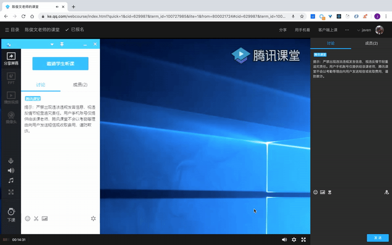
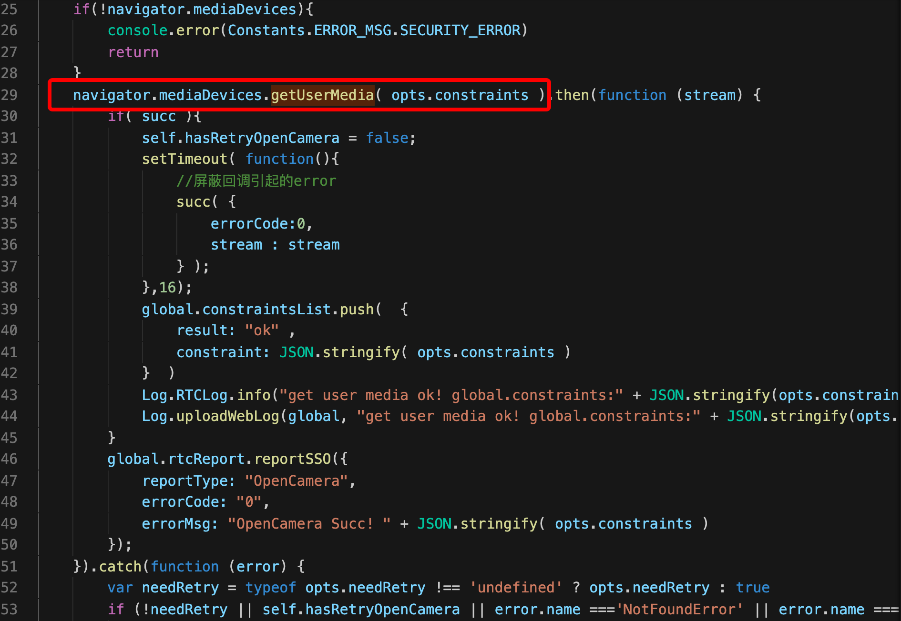
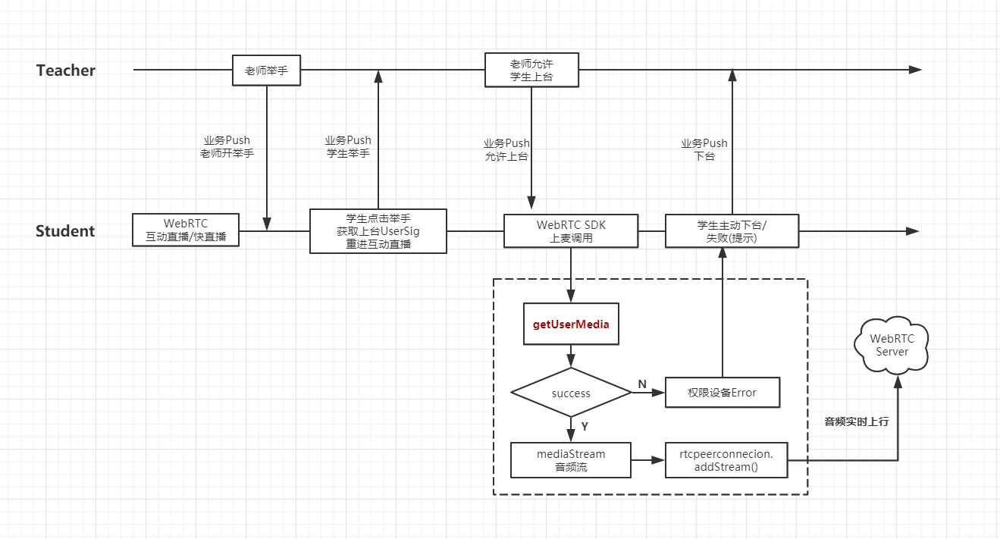
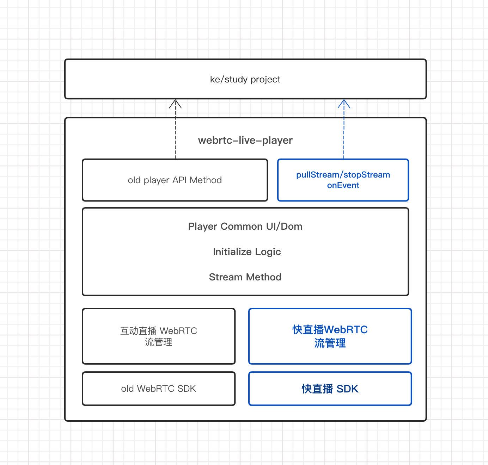
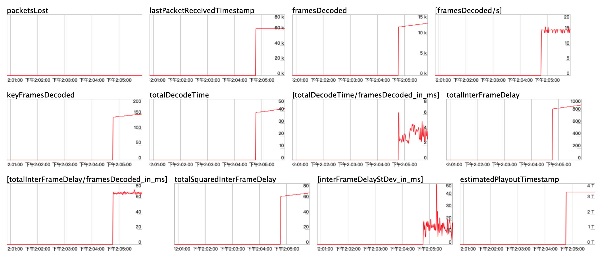

# 腾讯课堂WebRTC上麦和快直播实践

## 背景
2020年春节过后，因为疫情不仅大家无法上班，学生也无法走进学校上课。保障“停课不停学”，腾讯课堂迎来几百万同时在线上课学生的同时，在线教育部的研发同事们也迎来了巨大挑战。

在线教育的音视频上课场景，无外乎看重：**低延迟**、**可互动**。而这次还多了要支持庞大的同时在线数。

因此在上课高峰来临前，IMWeb音视频前端小分队的最优先两个任务是：

* 浏览器中直播上课，需要支持 **学生举手上麦** 的能力，提升上课互动体验。
* 受限于互动直播WebRTC无法支持几十万同时在线数，需要接入**快直播WebRTC** 来保障Web端的上课高峰。

## 浏览器端举手上麦

先展示最终效果如下（画面为老师分享桌面，方便同时展示老师和学生操作）：



很简单：老师先发起举手，学生点击举手后等待老师点名，老师选择学生上台发言，最后学生就能和老师通话了。


对于前端而言，可能会认为类似上麦这种需求在APP/客户端实现的比较多，但在浏览器中能否实现会有两个主要疑问：

* 主是浏览器有权限调用系统设备（麦克风）吗 ？
* 调用设备录音后，是如何将音频数据实时发送上行的？


### 浏览器 getUserMedia 采集音视频

其实目前大部分浏览器都支持调用系统硬件设备（如麦克风、摄像头）来进行音视频的录制。这就需要通过浏览器API  `navigator.mediaDevices.getUserMedia`，来拿到本地媒体流。以下WebRTC SDK相关代码：




其中 参数 constraints 是约束，如只采集麦克风音频或摄像头视频，你可以这么设置：

```javascript
const mediaStreamContrains = { 
    video: true, 
    audio: true
};
```

又或者你可以进一步对采集做限制
音频：采样率、采样大小、音量、是否回音消除、是否自动降噪、是否自动增益

视频：分辨率宽高、帧率、宽高比、前置/后置摄像头等

```javascript
const mediaStreamContrains = {
    video: {
        frameRate: {min: 15},
        width: {min: 640, ideal: 1280},
        height: {min: 360, ideal: 720},
        aspectRatio: 16/9
    },
    audio: {
        echoCancellation: true,
        noiseSuppression: true,
        autoGainControl: true
    }
};
```

当然`navigator.mediaDevices.getUserMedia`并不保证能一定获取到媒体数据。和APP调用系统权限一样，浏览器器会弹出询问提示窗口来索取权限。


异常情况包含以下几种：
* AbortError［中止错误］
* NotAllowedError［拒绝错误］
* NotFoundError［找不到错误］
* NotReadableError［无法读取错误］
* OverConstrainedError［无法满足要求错误］
* SecurityError［安全错误］
* TypeError［类型错误］没有设置Constraint

因此可以对不同类型的错误做相应记录，并给予用户提示。


### 获取流并添加流上行

因为学生上麦只需要音频，因此constraints将audio设为true即可，获取流后添加到**上行的RTCPeerConnection**中。

```javascript
const constraints = { audio:true }

navigator.mediaDevices.getUserMedia(constraints)
.then(function(mediaStream) {
    //  senderConnection是上行的rtcpeerconnection
  senderConnection.addStream(mediaStream)
}).catch((error)=>{
    //根据error给予错误提示
})
```

以上就是麦克风音频流如何上行的代码，但SDK前后前后内部逻辑更复杂些。

> 你会疑问：平时听说的回音消除，网络差时防抖都不用处理吗？
> 是的没错！因为这些WebRTC浏览器底层做了很好的处理。前端开发者只需关注业务，直接调用即可。

### 举手上麦的整体业务+SDK调用流程

在大房的互动直播中，最多只能支持6名学生同时上麦。在一个班级房间中，绝大部分学生的大部分时间都只是收看的，只有当老师允许举手时，学生才能举手并上台发言。

在获取腾讯云WebRTC签名进房时，还要对”只收看“和”要上台发言“的两部分学生，区分调整权限参数。

```javascript
//抽象代码
const WEBRTCRIGHTFLAG = {
    ALL: 255, // 所有权限，可以上行
    WATCH: 171, // 只能下行
};

 const params = {
    sdk_appid: CLOUDSDKAPPID,
    term_id: termId,
    // 判断只是收看，还是需要互动上麦
    uint64_want_privilege_map: !this.needGetAllRight ? WEBRTCRIGHTFLAG.WATCH : WEBRTCRIGHTFLAG.ALL,
    platform: PLATFORM.WEB,
};
const getSigUrl = `获取签名的CGI请求地址`;

keFetch(getSigUrl, {
    method: 'GET',
}).then((data) => {
    this.handleSig(data.userSig)
}).catch((err) => {

})
```

学生在不同阶段时根据当前需要，在获取UserSig时指定privilege_map参数。

最后结合举手业务流程和上麦的SDK调用流程，梳理总结出下面的流程图：





结合最前面的展示效果，可以看到在学生执行上麦逻辑时，浏览器会提示是否允许获取麦克风设备。允许后，学生执行音频上行到互动直播的WebRTC服务，老师下行便能接收到学生音频流。

## 快直播WebRTC接入

### 为什么是快直播

首先需要说明的是，此处说的快直播和原本互动直播，在浏览器端都是使用WebRTC进行音视频实时通讯，只是背后音视频服务的传输链路有区别。

* **快直播WebRTC**：通过流地址，经由腾讯云WebRTC Server,从腾讯云直播平台拉取直播流。并以WebRTC下发流。且信令服务无关房间逻辑。适合单流纯收看的场景。


* **互动直播WebRTC** ：通过签名userSig鉴权进房，包含房间业务逻辑，主播/观众模式，信令服务通知流状态更新变化，支持观众上麦。

直接对比一下：

| 方案 |  房间逻辑 | 拉流方式 | 流更新 | 主辅路| 支持上行|
|-----|-------|-----|-----|-----|-----|
| 快直播WebRTC |  无：只用流地址 | 腾讯云直播平台拉流（目前只支持原流，不支持混流）   | 无：只通知当流增加/移除，需要业务层实现| 无，需要拉两路流，且无法保证同步 | 不支持 |
| 互动WebRTC | 有：通过签名鉴权进房|  进房后自动下发  | 有，房间内信令通知 | 有主辅路，且同步 | 支持 |


总体上来说，快直播只适合纯观看的场景，而互动直播WebRTC有房间逻辑，支持主辅路，上麦互动等等特性，相比之下更适合现有的在线教育场景。


但它的服务架构更复杂，受限于种种原因，目前互动直播的WebRTC还无法支持几十万同时在线。而降级方案CDN直播，虽然理论上支持无上限同时收看人数，但确做不到低延迟。

而快直播WebRTC可以支持几十万的低延时直播 ，并且还支持向上扩容。面对腾讯课堂迎来的上课高峰，**Web端需要紧急接入快直播，并且改造成适合在线教育的场景**。


### 快直播接入开发

对于纯观看直播场景，快直播的接入并不复杂。可以参考文档https://cloud.webrtc.qq.com/doc/WebRTCLiveMan.html

1. 向业务获取老师当前的主辅路流，并接受push通知，实时更新拉取。

2. 前端快直播拉流：

```javascript
// teacherStreamUrl为从业务后台拿的直播流地址
const teacherStreamUrl='webrtc://keonline.liveplay.qq.com/live/42824_e705d155a676d5a52e34d2f438ae00d8?txSecret=9456af788e04feb6f89de5cfbc17f588&txTime=158234289'

TXWebRTCAPI.pullStream(teacherStreamUrl); 
```

3. 监听获取快直播流，并给到播放器播放

```
// 流添加
TXWebRTCAPI.on("onAddStream", (event)=>{
    const teacherStream = e.stream
})

// 流移除
TXWebRTCAPI.on("onRemoveStream", (event)=>{
    const teacherStream = e.stream;
    const errorCode=e.code
})
```

### 快直播整体流程

当然接入并不会这么简单，因为上课场景并不会单路流从头看到尾，在适配改造前，让我们看下快直播的整体流程。红色为web端快直播的相关流程，可以发现快直播兜兜转转还是从云直播平台拉流，那为什么不直接云直播平台拉流播放呢？

可以发现快直播本质是：**（从云直播平台）拉取流，改用WebRTC形式下行到浏览器直播，目的就是为了更低的延时而已。（对比RTMP/FLV/HLS，WebRTC可以实现1秒内延时）**。舍弃互动直播房间逻辑，只负责拉流推流，让快直播WebRTC向上扩容成为可能。

### 快直播播放器改造

由于上课场景并不会单路流从头看到尾，老师可能随时切换PPT、视频、摄像头，并且画中画两路流来也会回切换。

而原本的webrtc播放器只针对互动WebRTC设计，流的切换完全由云webrtc信令通知，播放器再做处理，业务层无需关注。

但是快直播的拉流需要业务Push通知，流地址也要从业务CGI获取，而拉流之后的成功和失败则由云的信令通知。

短时间内专门做一个快直播播放器并不现实，只能在原有播放器做**增量适配改造**。



改造思路：蓝色为新增。

1. 复用原本播放器 UI/Dom，初始化逻辑，以及流的封装封方法等。
2. 原本互动WebRTC 流管理 和SDK相关逻辑保持不变。
3. 新增快直播SDK调用，及快直播流管理：包含拉流后的流增加和流移除、多路流管理的主辅路关系映射等。
4. 播放器原本接口不变，新增拉流和停止拉流的接口及事件抛出。


流管理基于quickStreams对象，管理对象和主辅路的映射关系。
```javascript
this.quickStreams = {
    '42824_e705d155a676d5a52e34d2f438ae00d8':{
        streamUrl:'webrtc://keonline.liveplay.qq.com/live/42824_e705d155a676d5a52e34d2f438ae00d8?txSecret=9456af788e04feb6f89de5cfbc17f588&txTime=158234289',//流地址
        type: 'main',//'main或vice，当前大小画面的映射标识'
        stream: <MediaStream> //miedaStream
    },
};
```

要注意下三点：

* 第一点：由于播放器接收业务和云的两放信令控制，由于两者下发时机是有差异的，这就无法很难保证当前的流映射关系是正确的。因此要规定两端信令的控制范围： **业务信令只控制流状态映射的更新**，而**云信令只控制流能否播放**

* 第二点：由于快直播sdk无法二次拉取相同的流。收到更新和拉流前，遍历quickStreams中流是否已经存，并检查流状态。**如果存在切正常则无需重新拉流，只更新流的主辅路对大小画面的映射关系**。

* 第三点：由于快直播多路流，通过多个PeerConnection传输（互动webrtc主辅路两路流只通过一个PeerConnection），因此会存在主辅路轻微不同步的问题。这时候**音频应该以大画面为准，避免音画不同步**。


### 完善监控与上报

这次接入快直播WebRTC，除了补充快直播的监控上报外，还对增强原本的监控逻辑。

1. removeStream 异常监控
```
case 20004:// 防盗链鉴权服务器内部错误，建议重试
case 20005:// 服务器内部错误，建议重试
case 20009:// 数据通道连接超时，出现该错误，业务可以提示用户网络异常，刷新重试
case 20011:// 流异常断开,可能是主播下播或者网络异常，建议重试重新拉流
case 20012:// 流结束
case 20014:// 防盗链鉴权失败
case 20015:// 客户端跟后台数据通道超时断开
```
2. 黑屏检测：当收到视频帧后，且未下课前。每秒检测黑屏情况，超出阀值做降级处理。检测方法如下：
```
setInterval(() => {
    const mainVideo=his.mainVideo.getDom()
    if(mainVideo.srcObject && mainVideo.srcObject.active && mainVideo.readyState !== 4){
        // 判断为黑屏
    }
},1000)
```
3. 加入丢包率与卡顿率上报：SDK调用浏览getStats API获取WebRTC报告数据，对`packetLost`、`packetsReceived`、`interframeDelay`这些核心度量数据做收集。快直播SDK每2s抛出质量数据，但由于web侧几十万同时在线数，频繁上报带来会带较大大压力。因此基于质量数据做60s的前端合并计算后， 再进行上报。


```
type: "stream_quality"
content:
decInfo:
streamid: "42824_2b851a8b0e208fa8c5f0c129ed6daf43"
streamurl: "webrtc://keonline.liveplay.qq.com/live/42824_2b851a8b0e208fa8c5f0c129ed6daf43?txSecret=3e403590486c92f3f63e7293545c597d&txTime=1583733346"

audio:
ssrc: "16884383"
codec: "opus"
packetsReceived: 104
bytesReceived: 12424
packetsLost: 0

video:
ssrc: "33750382"
codec: "H264"
packetsReceived: 29
bytesReceived: 4279
packetsLost: 0
width: 1328
height: 672
framesDecoded: 13
framesReceived: 14
interFrameDelayMax: 136
```

## 总结

虽然此次紧急需求在短短几天就完成开发并上线，但由于开发时间短，代码层面没有完全很好梳理：

* 受限播放器原本的设计，只适用于互动WebRTC，这次采取增量改造方式来开发。互动WebRTC、快直播WebRTC、FLV、HLS直播间的切换都需要播放器层级的销毁与重载，应该还能再优化。

* 应对高峰课我们只能继续加很多监控点，但上报点分散，包袱越来越多，急需后续对Web端和H5端上报点做统一归拢，根据业务和端做上报的配置化，从而不必频繁多端改造播放器。


在 "**快速保障业务优先**" 的前提下，此次暴露了一些没有发现的问题，虽还掉了一些欠债，但原本播放器打补丁式的新增开发，也增添了些新债务。我们没法避免飞快的任务需求节奏，除了开发效率，也要保持所负责的代码时刻处于合理健康的状态，视角也要面向未来潜在的挑战。

小分队讨论接下来做一款设计更合理的，并且支持多种形式播放的**Web直播播放器**。目标是体验和质量更优、提升维护性和扩展性。


## 写在最后

对于音视频前端小分队而言，以上提到的只是小小一部分。在超哥带领下快速完成包括：协调扩容，流控降级策略，完善监控，日志排查，体验优化和改进，并同各位同事一起遇到问题就解决问题。

随着腾讯课堂PCU不断突破新高，仅Web浏览器端就有近60万的同时在线上课高峰。

最后特别提及 jayccchen 超哥、lizzydeng 邓雪，以及各位OED开发同学和腾讯云同事日以继日加班加点的付出，保证了此次腾讯课堂高峰课web端上课的音视频质量。

PS：
 如果有想同我们深入研究、共同探索 web 音视频的同学，欢迎加入我们 **IMWeb 团队**。在线教育部有许多音视频场景，期待你施展拳脚，感兴趣的同学可以直接联系我。